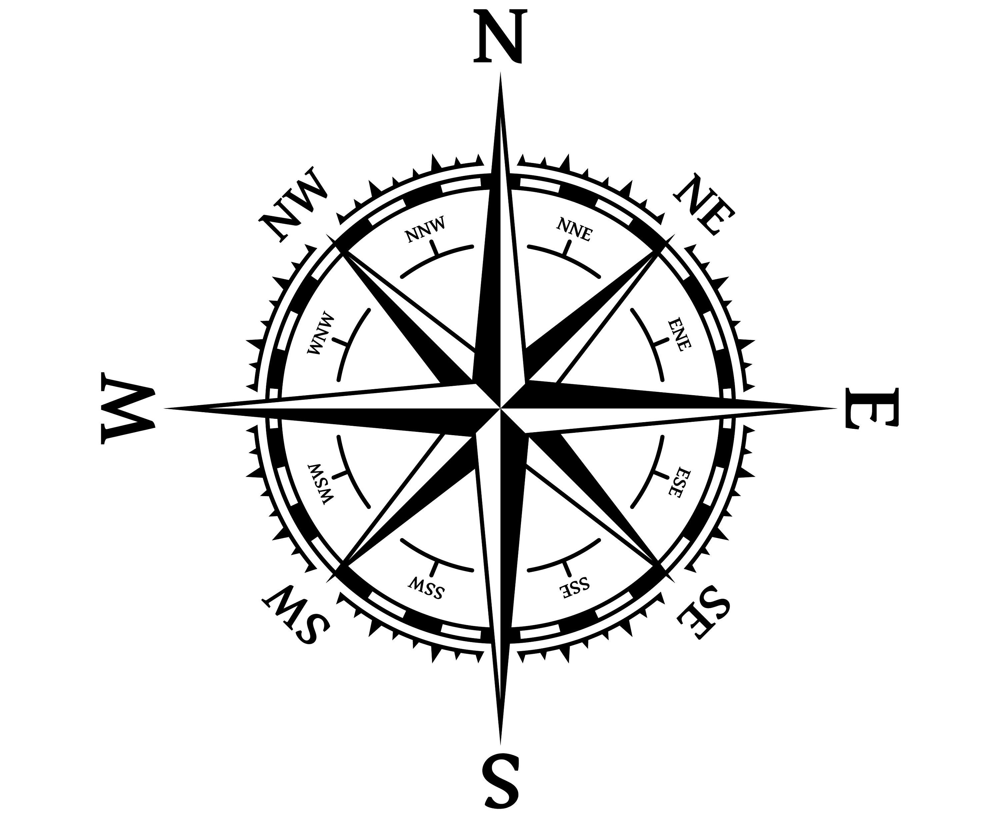

# IELTS Study Guide

## Vocabulary

Rubbish, tremble, cuisine, ran out of time, catch a cold, as for, rather than, vast majority, throughout, considerably, released, is a must have, bitterly cold, highlight.

## Writing Task 1

- Short report giving key information about charts, maps or diagrams.
- It's recommeded to spend 20 minutes.
- Need at least 150 words.
- Six types of data: Bar graphs, line graphs, pie charts, flow charts, tables, diagrams or processes.
- Ask these four questions:
    * What is the key data? Axes/columns+rows/keys+titles
    * What are the trends? Increase or decrease
    * What are the differences or similarities? 
    * Can I put the data into two groups?
- Reference figures, logically orginize the writting.
- Try not to repeat vocabulary often.
- Make a plan.
    * *Group 1 and group 2*. Describe each group in different paragraphs.
    * *Overview*. Short and briefly description without going into too much detail.
- Structure:
    * *Introduction*. Paraphrase the question
    * *Overview*. Big picture, start with "overall"
    * *Detail paragraph 1*
    * *Detail paragraph 2*

### Vocabulary

X axis, chart, plot, bars, slices, types, recorded, increases steadily, decreases, quite dramatically, consistently increase, recover, reported, spend, budget, dropped, highest, time periods, stages, quite highly, ilustrates, gives information, depicts/describes, shows, represents, compares, the way in which, slow downturn, final rise, overall, trend, to begin with, rose, largest increase, upturn, grew, slightly, respectively, runs through, removed, develop, the process begins, after this, splits, stages, accurately, landmarks, situated, highest voted, large fluctuations, duplicating, tripling, by the year, span, more than halved, below, remained unchanged.

&nbsp;

#### Synonyms or words with similar meaning

1. Profits - Total Income - Earnings
2. Built - Develop - Added -Constructed - Transformed
3. Removed - Replaced - Demolished
4. Gradually - Slightly - Slowly - Moderate - Steadily
5. Rapidly - Sharply - Quickly - Rapidly - Steeply
6. Rose - Grew - Climbed - Increased - Rocketed
7. Declined - Fall - Dropped - Decreased - Plunged
8. Laps - span

&nbsp;

#### Essential Vocabulary - Graphs

| Opener           | Info. Type      | Verb              |
|------------------|-----------------|-------------------|
| The given...     | Bar chart/graph | Shows/illustrates |
| The preceding... | Table/diagram   | Compares/gives    |
| The supplied...  | Map/pie chart   | Describes/depicts |
| The shown...     |                 | Gives information |

The overview should talk about general characteristics of both groups.

&nbsp;

#### Essential Vocabulary - Maps

| Addition                 | Removed      | Changed     | Expanded  |
|--------------------------|--------------|-------------|-----------|
| Added                    | Removed      | Converted   | Expanded  |
| Built                    | Demolished   | Redeveloped | Extended  |
| Erected                  | Knocked Down | Renovated   | Developed |
| Constructed              | Taken Down   |             |           | 
| Planted (Forests, trees) | Destroyed    |             |           |

The overview should contain two general statements.

Use wind rose to describe locations

&nbsp;

#### Essential Vocabulary - Processes

| First Stage         | Middle Stage      | Final Stage    |
|---------------------|-------------------|----------------|
| To begin with...    | Next...           | Finally...     |
| In the beginning... | After that...     | Ultimatelly... |
| Initially           | Following this... |                |
|                     | At this point...  |                |

- Ask the questions 
    1. Natural or man made?
    2. Cyclical or linear?
    3. How many stages?
    4. Where does it start and end?
    5. What is produced?

&nbsp;

### Grammar

#### Making Comparisons

1. *More/less + Adj + Than*

    Ej. "We can clearly see that taxis where **more popular than** walking by 6%

2. *More/Less + Noun + Preferred + Than*
    
    Ej. "We can see that **less people enjoyed** riding trains **than** driving cars"

#### Describing Trends

1. *There was + Adj + Noun + In*
    
    Ej. "From 2002 to 2004, **there was a significant rise in** enrollments to course B"

#### Increases and Decreases

1. *Noun phrase + Verb + Adverb*

    Ej. "From 2006 to 2010, **playing music climbed steadily** to 26% of owners using the feature"

    Ej. "**Playing games jumped sharply** from 2006 to 2008. However, over the following two years it's overall use declined by 1%"

### Features Checklist

- Paraphrased introduction
- Overview
- Detail paragraphs one and two
- Clear grouping
- Adverb + verb (rapidly increased)
- Adjective + noun (steady decline)
- Mixed openers

## Writing Task 2

- Write an essay about a statement and give your opinion or thoughts.
- 250 words or more.
- Write some ideas for each paragraph and be more organized. Stay with three or two main points for each paragraph.
- Structure:
    * *Introduction*
    * *Supporting paragraph 1*
    * *Supporting paragraph 2*
    * *Conclusion*
- Five question types:
    1. *Agree or disagree*. 

        Ej. "Using a computer everyday will have a negative effect on children. Do you agree or disagree?"

    2. *Advantages + disadvantages*.

        Ej. "Many young people are travelling abroad to find work. What are the advantages and disadvantages of leaving your country to find work?"

    3. *Discussion*.

        Ej. "Some people believe that exercise is the key to a healthy life, while others feel diet is more important. Discuss both sides and give your opinion"

    4. *Problem + solution*. 
        
        Ej. "Overpopulation in many urban areas is becoming a major issue worldwide. What are the causes of this and how could the situation be improved?"

    5. *Two part question*.

        Ej. "Some parents buy their children whatever they ask for. Is this a good way to raise children? What consequences might this have for the child as they grow older?

|                            | Agree or Disagree (opinion)           | Advantages + Disadvantages               | Discussion                               | Problem + Solution                            | Two Part Question                        |
|----------------------------|---------------------------------------|------------------------------------------|------------------------------------------|-----------------------------------------------|------------------------------------------|
| **Introduction**           | 3 sentences                           | 3 sentences                              | 3 sentences                              | 3 sentences                                   | 3 sentences                              |
| **Supporting Paragraph 1** | Explore first opinion                 | Discuss advantage or disadvantage        | Discuss first type of thinking           | Explore first problem and possible solutions  | Discuss the first question               |
| **Supporting Paragraph 2** | Explore second opinion                | Discuss advantage or disadvantage        | Discuss second type of thinking          | Explore second problem and possible solutions | Discuss the second question              |
| **Conclusion**             | Summarise and give your opinion again | Summarise and give your opinion if asked | Summarise and give your opinion if asked | Summarise and give your opinion if asked      | Summarise and give your opinion if asked |

&nbsp;

- **Introduction**. Only 3 sentences using the exact same formula for every question.
    * Paraphrase the question using synonyms.

        Ej. "A person's finantial situation is often considered a good measure of success"

    * Plan your essay's viewpoint (Use "In this essay", "Throughout this essay")

        Ej. "This essay disagrees that wealth is a true measure for how successful people are"

    * Outline what you will discuss in your two supporting paragraphs (Use "Firstly, I will... and secondly ...")

        Ej. "Firstly, this essay will give reasons for why wealth is not a good measure and secondly I will define what I believe a successful person is"

- **Supporting paragraphs**. There are 3 main sentence types to include in your body paragraphs, except for problem + solution. 
    * *Topic sentence*. The main idea/point you are making. Links to the question (Use "To begin with", "Firstly", "First of all", "To start with", "Many people feel", "In the first place").
        
        Ej. "Fast foods are a serious problem facing our societies for numerous reasons but health and obesity are both huge concerns"

    * *Support*. Says why this is important, give extra information (Use "Furthermore", "As a result of", "Moreover", "Consequently", "What is more", "As an effect")

        Ej. "As people become overweight, they will also have a higher chance of being ill"

    * *Example*. Provides a real life example of the idea discussed

        Ej. "For instance, obseity is understood to be one of the major causes of heart disease in adults"
    
    For "problem + solution" type questions

    * *Topic sentence*.

        Ej. "One of the big problems facing industrialised countries is the deteriorating quality of air, especially in places with large factories or in cities"

    * *Support*.

        Ej. "As people are breathing in this toxic air on a daily basis, it is very much affecting their health and will make citizens sick because of this"

    * *Solution*.

        Ej. "One solution to this problem could be to cut emissions from local factories and transport around the area"

    * *Result*.

        Ej. "AS a result of this, air quality would become much cleaner which would lead to an improvement in people's health and less of a buden on doctors and hospitals"

- **Conclusions**. Summarize and paraphrase the main points in your essay. Give your opinion if asked, and say how you feel about the topic. 
    
    Ej. "To sum up, we currently use animals for many useful reasons, from food to clothing, although there are ethical issues to consider as well. In my view, the advantages vastly outweigh the disadvantages and we should continue to use animals for our own use where needed".

    For problem + solution type question, second sentence should make a recommendation and mention who can fix it
    
    Ej. "In conclusion, the problems associated with pollution are clearly becoming a major issue in many countries. In my view, the government should prioritise cleaning the local environment and citizens' health above the financial rewards of industry and growth"
 
    Use "To sum up", "In conclusion", "In summary" to summarize. Use "I believe that", "In my opinion, "I feel" to give your opinion

&nbsp;

### Vocabulary
Furthermore, for instance, outweigh, vastly outweigh, although, to sum up, as well, in my wiew, global issue, finding accommodation, densely populated areas, because, and furthermore, therefore, however, and in addition, whatever.

*Technology*. Device, social media, cutting edge, intuitive, breakthrough, design

*Education*. Education system, social impact, attainment (), academic, graduate, hands-on, welfare (well-being)

*Health*. Wellness, physical well being, mental well being, fitnes, infection, obseity, vitamins

*Environment*. Pollution, conservation, eco friendly, endangered, global warming, habitat, fossil fuels

*Society*. Values, stereotype, globalization, emigrate, contribute, poverty, culture shock

Today's society is giving more importance to consumer goods. Throughout the essay I will talk about some of the advantages and disadvantages of this behaviour, firstly describing the advantages, and at the end, the disadvantages.

To start with, consumer goods involve many different products, such as electrodomestics and jewerly, 

## Speaking

- This test measures your ability to communicate verbally in English accross a range of topics and questions.
- There are three partes. It will take between 11 to 14 minutes.
- Topics:
    * Greetings and introductory questions
    * Topic Cue Card - extended speaking
    * Interview style questions

### Part 1 - Introduction

You will greet the examiner and have some questions on familiar topics such as: family, studies, sport, hobbies...

As soon as enter the room, your test has begun. In total, you will receive 12 questions. Don't give short answers!

### Part 2 - Topic Cue Card

You will be given a card asking to describe a common situation. The card gives some prompts to help give you some ideas.

You must speak for between 1 - 2 minutes without interruption. You will have 1 minute to plan your response.

Common topics: sports, news, education, family, books, art, exercise, language, dreams, holidays

### Part 3 - Questions / Interview

You will receive more questions, this time linked to the topic you discussed in part 2.

You still must answer questions at length. Often you will be asked to predict or explain your thinking in depth. 

